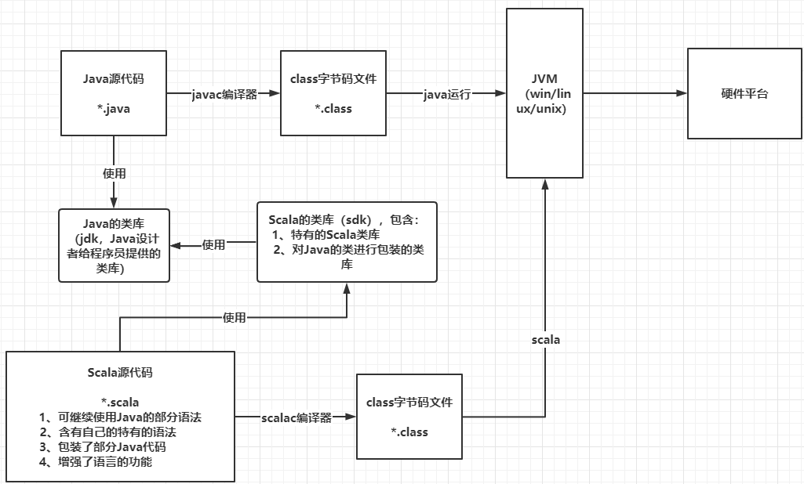

<div align="center">
<p>
 
 <p align="center"><b><font size=6>Scala</font></b></p>
 <p align="center"><b>子标题（说明）</b></p>
</p>


[](LICENSE)


<div align="left">
<!-- 顶部至此截止 -->


<!-- SPbSTU 报告起始 -->

<div align="center">
  <!--  新式 π logo -->
   <!-- 研究型大学 logo -->
  </br>
  <b><font size=3>Санкт-Петербургский политехнический университет Петра Великого</font></b>
  </br>
  <b><font size=2>Институт компьютерных наук и технологий</font></b>
  </br>
  <b><font size=2>Высшая школа программной инженерии</font></b>
</div>


<div align=left>
<div STYLE="page-break-after: always;"></div>
<!-- SPbSTU 报告结束 -->


[toc]


# 介绍

## Scala


> 阅读：
>
> - [尚硅谷大数据技术之Scala入门到精通教程](https://www.bilibili.com/video/BV1Xh411S7bP)（本文参考）
> - [Scala官网语法速查](https://docs.scala-lang.org/zh-cn/cheatsheets/index.html)
> - [Scala官方文档 Tour Of Scala](https://docs.scala-lang.org/zh-cn/tour/tour-of-scala.html)
> - https://github.com/tch0/notes/blob/master/Scala.md

Scala 运行于[Java平台](https://zh.wikipedia.org/wiki/Java平台)（[Java虚拟机](https://zh.wikipedia.org/wiki/Java虚拟机) JVM），和 Java 完全兼容，并将面向对象和函数式编程的最佳特性结合在一起的**静态类型编程语言**（静态语言需要提前编译的如：Java、c、c++等，动态语言如：js）。可以直接调用 Java 类库；同样具有跨平台、可移植性好、方便的垃圾回收等特性。


**特点：**

- Scala 比 Java 更加**面向对象**，可以认为是更近一层的 Java
- Scala 是一门多范式、**函数式编程语言**，支持面向对象和函数式编程（多范式，就是多种编程方法的意思。有面向过程、面向对象、泛型、函数式四种程序设计方法）
- Scala 源代码（.scala）会被编译成 Java 字节码（.class），然后运行于 JVM 之上，并可以调用现有的 Java 类库，实现两种语言的无缝对接
- Scala 在设计时，马丁奥德斯基是参考了 Java 的设计思想，可以 说Scala 是源于 Java，同时马丁奥德斯基也加入了自己的思想，将函数式编程语言的特点融合到JAVA中
- Scala 更**适合大数据**的处理
    - Scala 对**集合（list）类型数据处理**有非常好的支持，而**处理集合类数据是大数据的重要一环**
    - Spark 的底层用 Scala 编写


**关注点：**

- 类型推断、不变量、函数式编程、高级程序构造。
- 并发：actor模型。
- 和现有Java代码交互、相比Java异同和优缺。


### Scala 和 Java 及 JVM

**Scala和Java及JVM关系图：**

```
        javac               java
.java --------> .class ----------> run on JVM
.scala -------> .class ----------> run on JVM
        scalac              scala
```





### 安装

> **基于macOS的Scala环境搭建+IDEA：**https://zhuanlan.zhihu.com/p/344521073

**环境配置：**

Windows中下载安装配置环境变量：

- 类似于java配置`SCALA_HOME`为安装目录。
- 添加`%SCALA_HOME%\bin`到path环境变量。

Linux中类似，可以使用包管理器，但如果依赖版本不严格一致的话，需要官网下载对应版本安装即可。

也有交互式执行环境：

```
scala
```


交互式执行环境中的传统艺能：

```
println("hello,world!")
```


暂时不管项目配置，还是单文件编译执行为主，项目开发肯定要以包的形式组织可以使用**IntelliJ IDEA开发，使用maven**或者sbt进行项目配置。

使用VSCode编辑器，安装插件Scala Syntax (official)和Scala (Mentals)。

新建文件`HelloScala.scala`。

```scala
object HelloScala { // HelloScala is a object, 全局只有一份，相当于 Java 中的静态对象
    def main(args : Array[String]) : Unit = {
        println("hello,world!");
    }
}
```


可以使用插件CodeRunner直接快捷键运行。也可以在命令行编译为字节码后再运行：

```
scalac HelloScala.scala
scala helloScala
```


或者直接运行scala源文件：

```
scala HelloScala.scala
```


和java如出一辙。

如果编译的话会生成2个`.class`字节码文件，`HelloScala.class`和`HelloScala$.class`。都是字节码但是不能通过`java`直接运行。但对于HelloWorld这个例子来说，java源代码编译而成的字节码是可以通过`scala`命令运行的。

原因是没有引入Scala的库，添加`classpath`就可以通过java执行scala编译成的字节码了：

```
java -cp %SCALA_HOME%/lib/scala-library.jar; HelloScala
```


使用[Java Decompiler](http://java-decompiler.github.io/)反编译字节码到java源文件可以看到引入Scala库的逻辑。并且：

- scala源文件中的`HelloScala`对象编译后成为了一个类，但对象本身编译后就是生成的另一个类`HelloScala$`类的单例对象`HelloScala$.MODULE$`，称之为**伴生对象**。
- `HelloScala$`有一个`main`实例方法，`HelloScala`类的静态方法通过这个单例对象转调这个实例方法。完成打印。
- Scala比Java更面向对象。


### IDEA环境配置

> **基于macOS的Scala环境搭建+IDEA：**https://zhuanlan.zhihu.com/p/344521073
>
> 文中使用的方式：https://www.bilibili.com/video/BV1Xh411S7bP/?p=8&spm_id_from=pageDriver&vd_source=d8e4362c5a7a2a744149dae0bd9c79aa

使用 IntelliJ IDEA：

- 创建Maven项目，JDK版本17。
- 安装插件：Scala。一般默认都已经装了。
- Maven项目默认用Java写，在`main/`目录下新建目录`scala/`，然后将目录标记为Source Root。
- 这样甚至可以在同一个项目中混用Scala和Java源文件，并互相调用。
- 需要能够添加scala源文件，右键项目，添加框架支持，配置Scala SDK，选择，然后就可以右键添加Scala源文件了。
- 添加包，添加Scala类，选择对象，编辑源码。


> 在 IDEA 中 写一个 `main` 便可以自动补全

```scala
package VeryStarted

object HelloWorld {
  def main(args: Array[String]): Unit= {
    println("Hello,world!")
  }
}
```


- Ctrl + Shift + F10 运行。
- 可以看到执行的命令是`java`在`classpath`中引入了Scala的`jar`包形式的库。
- 调用java的类库：

```scala
package VeryStarted

object HelloWorld {
  def main(args: Array[String]): Unit= {
    println("Hello,world!")
    System.out.println("Hello,world! from java")
  }
}
```


语法含义：

```scala
object SingletonObject { body }
def MethodName(ArgName: ArgType): RetType = { body }
```


`object`关键字创建的伴生对象，可以理解为替代Java的`static`关键字的方式，将静态方法用单例对象的实例方法做了替代，做到了更纯粹的面向对象。

仅仅测试理解语法既可以单文件编写VSCode编译执行也可以用IDEA管理项目，影响不大。

再用一个等价的类定义来认识和区别一下Scala和Java：

java:

```
public class Student {
    private String name;
    private Integer age;
    private static String school = "XDU";

    public Student(String name, Integer age) {
        this.name = name;
        this.age = age;
    }

    public void printInfo() {
        System.out.println(this.name + " " + this.age + " " + Student.school);
    }

    // psvm
    public static void main(String[] args) {
        Student tch = new Student("tch", 20);
        tch.printInfo();
    }
}
```


scala:

```
package VeryStarted

class Student(name: String, age: Int) {
  def printInfo(): Unit = {
    println(name + " " + age + " " + Student.school)
  }
}

// 引入伴生对象，名称一致，同一个文件
object Student {
  val school: String = "XDU"

  def main(args: Array[String]): Unit = {
    val tch = new Student("tch", 20)
    tch.printInfo()
  }
}
```


Scala库源码与API文档：

- 官网上下载下载Scala源码，解压到Scala安装目录或任意位置。
- IntelliJ IDEA进入反编译的源码后选择右上角附加源码，选择源码的`src/`目录。
- 安装包里面已经有了文档，没有的话可以单独下载。
- Scala依赖Java，某些类型就是Java的包装，库中有一部分java源码。


## Spark


- 新一代内存级大数据**计算框架**，是大数据的重要内容

- Spark就是使用Scala编写的。因此为了更好的学习Spark，需要掌握Scala这门语言

- Spark的兴起，带动Scala语言的发展

- Spark 的底层用 Scala 编写

    

**Spark**是一个[开源](https://zh.wikipedia.org/wiki/开源)集群运算框架，最初是由加州大学柏克莱分校AMPLab所开发。相对于[Hadoop](https://zh.wikipedia.org/wiki/Apache_Hadoop)的[MapReduce](https://zh.wikipedia.org/wiki/MapReduce)会在执行完工作后将中介资料存放到磁盘中，**Spark使用了存储器内运算技术，能在资料尚未写入硬盘时即在存储器内分析运算**。Spark在存储器内执行程序的运算速度能做到比Hadoop MapReduce的运算速度快上100倍，即便是执行程序于硬盘时，Spark也能快上10倍速度。允许用户将资料加载至集群存储器，并多次对其进行查询，非常适合用于[机器学习](https://zh.wikipedia.org/wiki/机器学习)算法。


## 函数式编程

**函数式编程**，或称**函数程序设计**、**泛函编程**（英语：Functional programming），是一种[编程范型](https://zh.wikipedia.org/wiki/编程范型)，它将[电脑运算](https://zh.wikipedia.org/wiki/電腦運算)视为[函数](https://zh.wikipedia.org/wiki/函数)运算，并且避免使用程序[状态](https://zh.wikipedia.org/w/index.php?title=状态_(计算机科学)&action=edit&redlink=1)以及[可变物件](https://zh.wikipedia.org/wiki/不可變物件)。函数编程语言最重要的基础是[λ演算](https://baike.baidu.com/item/λ演算?fromModule=lemma_inlink)（lambda calculus）。而且λ演算的函数可以接受函数当作输入（引数）和输出（传出值）。比起[指令式编程](https://baike.baidu.com/item/指令式编程?fromModule=lemma_inlink)，函数式编程更加强调程序执行的结果而非执行的过程，倡导利用若干简单的执行单元让计算结果不断渐进，逐层推导复杂的运算，而不是设计一个复杂的执行过程。

lambda 表达式就是函数式编程的一种体现


